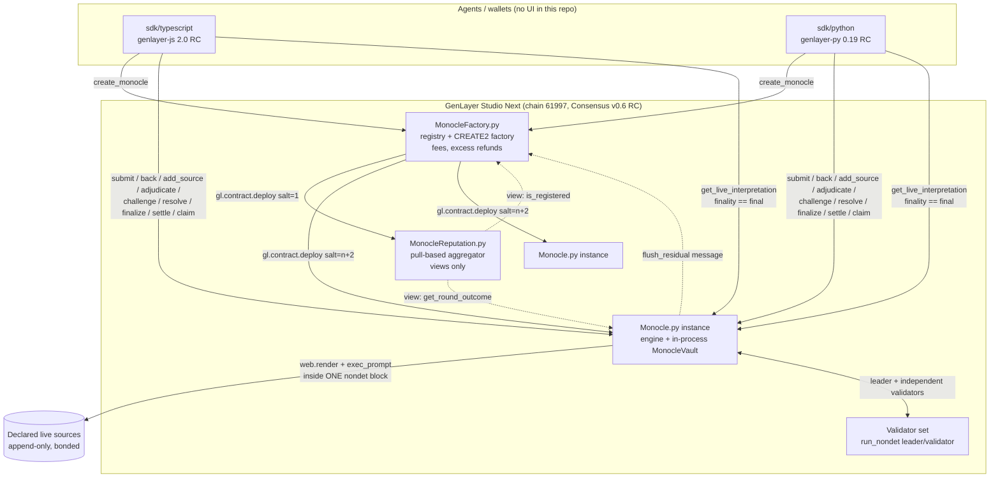
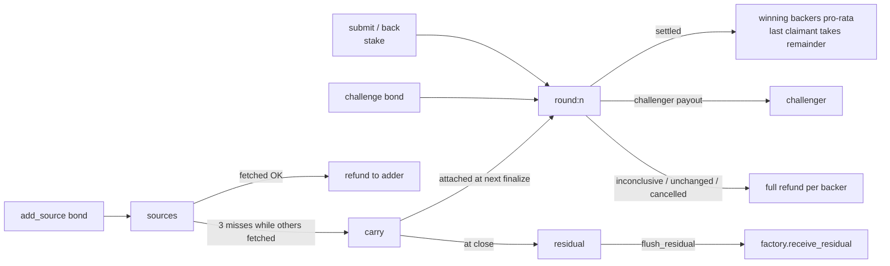

# Architecture

A Monocle is a real-time interpretation engine for a set of live sources.
People and agents bond GEN behind competing structured interpretations. Validators fetch the
sources, reason independently, and agree on which interpretation the evidence supports. The
winner becomes a live output that any agent or contract can read. The engine then opens a new
round, so the output keeps tracking a changing world.

It is not a prediction market, a court or an escrow. It is shared, capital-backed interpretation
infrastructure that can be updated over time.

## System overview



## Contracts

| Contract | Role |
| --- | --- |
| `contracts/Monocle.py` | One engine: sources, interpretations, adjudication, challenges, finality, settlement, timelocked close, local reputation, **and its own custody ledger (`MonocleVault`)** |
| `contracts/MonocleFactory.py` | Registry and CREATE2 factory. Stores creation-time metadata only. Charges exactly `creation_stake`, refunds any excess, receives residual flushes. The owner can only withdraw fees and set the stake for **future** Monocles |
| `contracts/MonocleReputation.py` | Cross-Monocle reputation aggregator. Permissionless and idempotent. Reads only |

All three pin the same runner: `py-genlayer:5jycge4q8k23462jtb0b9fyey1s9qz928sz2nbrd9mg4sxqg2qng`
(GenVM v0.6.0-rc5). See [STUDIO_NEXT.md](STUDIO_NEXT.md#runner-pin).

## Round state machine

```mermaid
stateDiagram-v2
    [*] --> open
    open --> adjudicating: adjudicate() (guard; rolled back on revert)
    adjudicating --> decided_pending: decided AND confidence >= 0.62
    adjudicating --> inconclusive: no_evidence / low confidence /<br/>invalid_verdict / insufficient_corroboration
    adjudicating --> unchanged: evidence hash == last FINAL hash<br/>and nothing new submitted
    open --> cancelled: cancel_round() after 24h<br/>or finalize_close() after timelock
    decided_pending --> finalized: finalize() after 1h window
    decided_pending --> challenged: challenge(bond)
    challenged --> resolving: resolve_challenge() (guard)
    resolving --> finalized: upheld / rejected / unresolved
    challenged --> finalized: finalize() after 24h (expired)
    finalized --> settled: settle()
    settled --> [*]: claim() pro-rata
    inconclusive --> [*]: claim() refund
    unchanged --> [*]: claim() refund
    cancelled --> [*]: claim() refund
```



A new round opens immediately after `inconclusive`, `unchanged` or `cancelled` (for the current
round), and after `finalized`. During `decided_pending` or `challenged` the current round stays
put: no new capital can enter a round whose verdict may still change.

`get_live_interpretation().finality` has three values:

* `"final"`: the returned interpretation survived its challenge window, or a challenge
  resolution. Only this may drive money.
* `"pending"`: no live output yet, but the current round has a pending verdict (see `pending`).
* `"none"`: nothing decided yet.

The contract-level `final` is separate from consensus finality. Agents must also read at, or
wait for, **FINALIZED** consensus (see [AGENT_SDK.md](AGENT_SDK.md#finality-rules-for-agents)).

## Vault decision

A separate `MonocleVault` contract was the first design considered. It was rejected after
checking how cross-contract writes behave on the v0.6 RC toolchain. **Custody stays
in-process**:

1. **What cross-contract writes are in v0.6.** In this SDK (`genlayer.contract`,
   runner `5jyc…`), a write to another contract is `gl.contract.get_at(a).emit(...).method()`. That
   emits an **internal message** that runs after the calling transaction is decided or finalized
   (`on='finalized'` by default). The return value is `None`, and the result never flows back to
   the caller. Only **views** (`get_at(a).view().m()`) are synchronous.
   In short: writes are asynchronous messages, never inline calls.
2. **Why that rules out a vault contract for `claim()`.** The vault has to debit a balance and
   pay the claimant *inside the same transaction that marks the claim*. Otherwise:
   * a claim can be recorded while the payout message later fails, leaving the stake stranded; or
   * the claim flag and the payout end up in different transactions, which opens double-pay
     windows.
   Custody split across transaction boundaries breaks the core invariant that every round
   ends claimable or reverts.
3. **Evidence that proves it:**
   * `tests/direct/test_vault.py::test_residual_after_close_flushes_to_factory_receive_residual`
     shows `emit` producing a queued `EmitInternalMessage`, not a call.
   * `tests/direct/test_system_glsim.py::test_residual_flush_lands_in_factory_and_is_withdrawable`
     shows the message only landing after the parent call completes.
   * `tests/direct/test_system_glsim.py::test_full_lifecycle_and_reputation_sync_via_cross_contract_views`
     shows views are synchronous.

So each Monocle is its own custodian. The custody logic lives in a separate class,
`MonocleVault`, in `Monocle.py`. Adjudication code never touches balances; it only calls
`credit`, `move` and `pay` through the ledger. The ledger's invariants are:

| Invariant | Enforced by | Tested by |
| --- | --- | --- |
| `sum(bucket balances) == vault_tracked` | every mutation updates both | `test_every_operation_keeps_bucket_sum_equal_to_tracked` |
| `vault_tracked <= native balance` | `get_vault_state().solvent` (reported) | `test_ledger_reports_insolvency` |
| never pay from an empty or short bucket | `_debit` checks bucket and tracked total | `test_ledger_never_pays_from_an_empty_or_short_bucket` |
| effects before interaction | `_debit` then `emit_transfer` | `test_ledger_credit_move_pay_conserve` |
| round isolation | one bucket per round (`round:<n>`) | `test_challenge_bond_is_isolated_per_round`, `test_claim_cannot_drain_a_different_rounds_pool` |
| everything in == everything out | settlement math + last-claimant remainder | `test_total_paid_equals_total_deposited_after_everyone_claims` |

Buckets:

* `round:<n>`: interpretation stakes, any challenge bond, and any bonus attached at finalize.
* `sources`: source-add bonds.
* `carry`: forfeited source bonds waiting for the next FINAL pot.
* `residual`: whatever is left after close, flushed to the factory.

The factory's `get_vault_model()` returns this decision so agents can discover it on-chain.

## Reputation decision

`MonocleReputation` is a **real, separate contract** and ships because it needs no
cross-contract writes. It pulls:

1. `record_round(monocle, round)` is permissionless and callable by anyone.
2. It reads `factory.is_registered(monocle)` (a view). An unregistered Monocle is rejected.
3. It reads `monocle.get_round_outcome(round)` (a view). The outcome is stake-free and carries a
   `final` flag. Only final rounds are accepted.
4. Each `(monocle, round)` pair is recorded at most once.

Each Monocle also keeps a **local** ledger (`get_reputation`), written at the moment a round
becomes final. Neither ledger is ever read by adjudication. Reputation is an output for other
agents and never an input to judgment. `test_reputation_is_never_an_adjudication_input` asserts
this on the actual prompt.

## Storage rationale

Storage uses only `TreeMap[str, str]` (JSON values), `DynArray[str]`, and primitive `str`,
`u256` and `Address` fields. Non-`str` TreeMap values (for example `TreeMap[str, u256]` or
dataclass values) are a known GenVM storage footgun on earlier builds: they deploy fine but become
unreadable. MONOCLE avoids them entirely; the rule costs nothing.

Floats never reach storage or calldata. Confidence, scores and wei amounts are decimal strings.
Addresses are keyed as lowercase hex (`_normalize_address`). Timestamps come from
`gl.message.raw["datetime"]`, the consensus datetime.

Round data is consolidated into one JSON record per round (`round_meta`) rather than many parallel
maps. The adjudication record, the challenge record and the interpretation id list stay separate,
so views can read them independently.

## Economic flows



Pot of a finalized round:

```
pot = stake_pool + bonus(carry attached) + challenge_bond - challenger_payout
```

`challenger_payout` depends on the challenge outcome:

| Outcome | `challenger_payout` |
| --- | --- |
| upheld | `bond + min(bond, stake_pool * 10%)` |
| rejected | `0` (the bond joins the pot) |
| unresolved or expired | `bond` (refunded) |

Winners split `pot` pro-rata by stake. The last winning claimant receives `pot - paid_so_far`,
so rounding dust never strands (`test_rounding_dust_goes_to_last_winning_claimant_never_strands`).

## Griefing analysis

| Vector | Defence |
| --- | --- |
| Creator losing a round closes to force refunds | `close_monocle` only starts a 2h timelock. Anyone may still `adjudicate`, and `finalize_close` refuses while a verdict is pending. `cancel_close` reverts to active (`test_close_starts_timelock…`, `test_backers_can_adjudicate…`) |
| Nobody adjudicates, stake stuck | `cancel_round` after 24h **and opens a successor round** (`test_cancel_round_after_timeout_unlocks_refund_and_opens_next_round`) |
| Challenge to delay finality | Needs a bond. Anyone can resolve immediately. An unresolvable challenge expires after 24h and the original winner stands |
| Source spam or dead sources | Bonded, 8 max, normalized uniqueness. A source that keeps failing while others work forfeits its bond. A global outage never costs anyone a bond |
| Interpretation spam | `min_interpretation_bond`, content-hash dedup per round, 12 per round. See the slot-squatting note in [AUDIT.md](AUDIT.md) |
| Creator-controlled single source | `MIN_SOURCES = 2`, plus a corroboration gate: the winner must cite ≥2 fetched sources |
| Overpaying the factory | The excess is refunded in the same transaction |

## What stays an LLM judgment

Choosing which interpretation "fits" fetched text is still a model's judgment. MONOCLE narrows
that judgment a lot:

* claim-level verdicts that must cite sources which actually fetched;
* a deterministic roll-up the chosen winner must agree with;
* corroboration and disqualification gates;
* independent validator re-derivation;
* a stricter confidence threshold;
* a challenge window.

None of this makes the judgment mechanical. [LIMITATIONS.md](LIMITATIONS.md) says so plainly.
